# 黑马租车 

## 学习目标

- 掌握面向对象中类与类中之间的关系

- 能够根据设计文档实现项目功能

  

## 第一章 需求


 

​	黑马出租车公司提供**轿车**和**客车**两种类型：

- 1）**轿车**如下：

  | 品牌                                                         | 型号                       | 车牌     | 日租金 |
  | ------------------------------------------------------------ | -------------------------- | -------- | ------ |
  | 奔驰  | C 200 L 时尚型运动轿车     | 赣BTK001 | 500    |
  | 宝马    | C 200 L 时尚型运动轿车     | 赣BTK002 | 400    |
  | 奥迪   | A5 Sportback 40TFSI 时尚型 | 赣BTK003 | 400    |

  **优惠活动：租车超过7天九折优惠，超过30天八折优惠，超过150天五折优惠。**

 

- 2）**客车**如下：

  | 品牌                                                         | 座位 | 车牌     | 日租金 |
  | ------------------------------------------------------------ | ---- | -------- | ------ |
  | 申沃客车  | 50   | 沪BTK666 | 1500   |

  **优惠活动：租车超过3天九折，超过7天八折，超过30天七折，超过150天五折。**


**需求：**

1. 写程序实现租车流程并计算租赁费用。
2. 写程序实现还车流程


## 第二章 设计

### 2.1 界面效果

**以下为呈现在用户的页面效果:**

##### **1）租车**

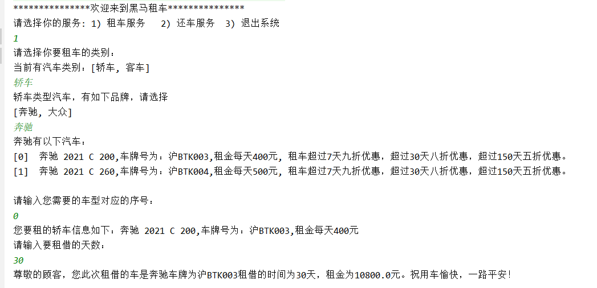 


##### **2）还车**

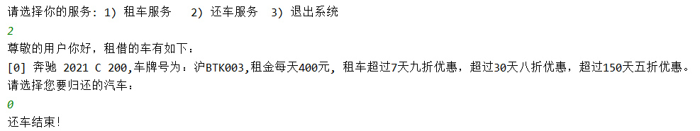 


###  2.2 面向对象设计步骤

#### 步骤概览

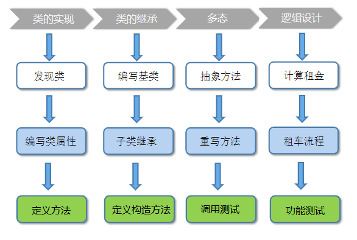


 

##### **1）类的实现**

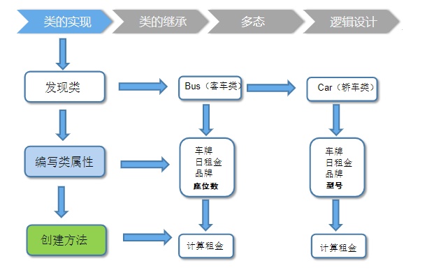

 

##### 2）类的继承

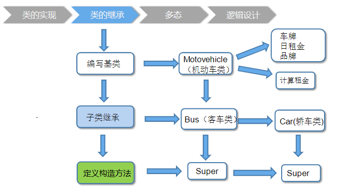

 

##### 3）多态

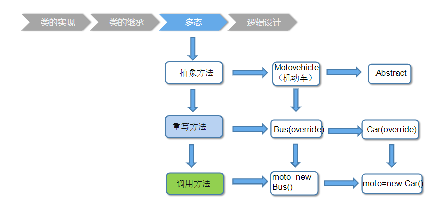


 


##### 4）逻辑设计

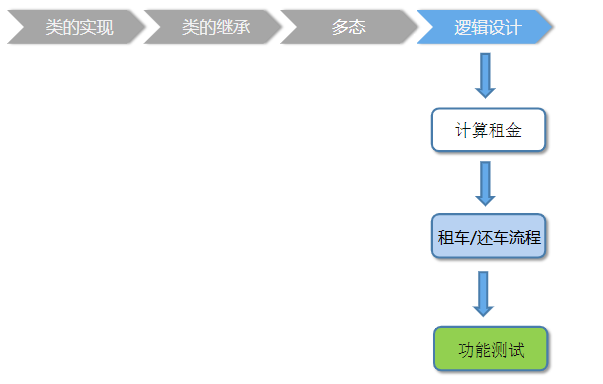


###### 1）租车业务流程

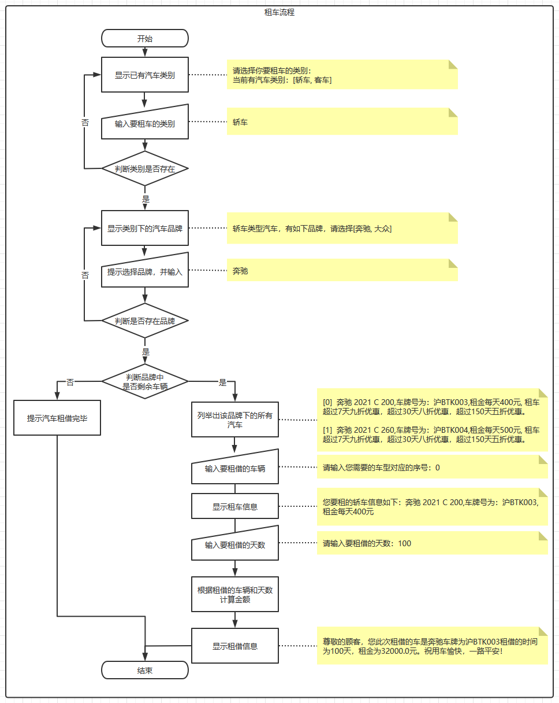


###### 2）还车业务流程

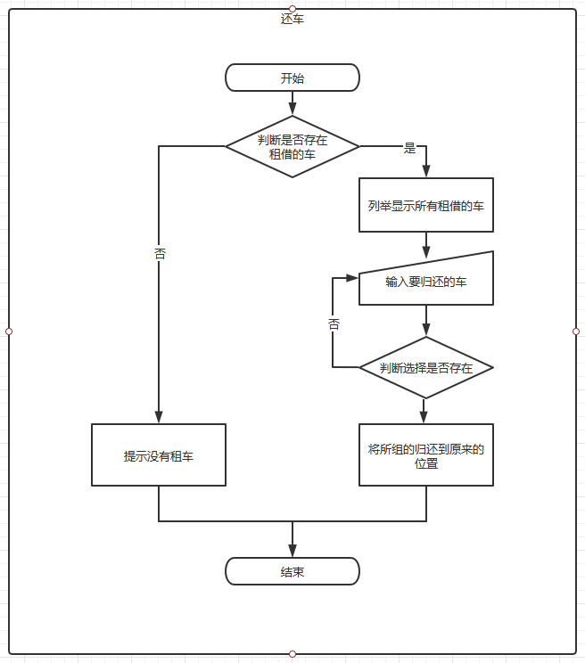


## 第三章 实现

### 3.1 项目技术概览

要实现本项目，需要包括但不限于以下核心技术点：

- 面向对象的项目设计流程
- 面向对象设计包含技术点
  1. 类，接口设计
  2. 面向对象的封装，继承，多态
- 数据的维护
  1. 集合的使用
  2. 集合的嵌套
- JDK中相关API的使用


### 3.2 项目实现步骤

#### 1 创建模块

#### 2 按照面向对象思想及步骤把对应的数据模型类设计好

**包图：**

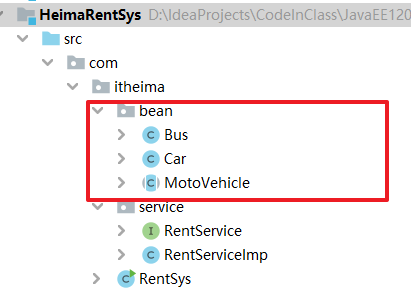

**继承体系图：**

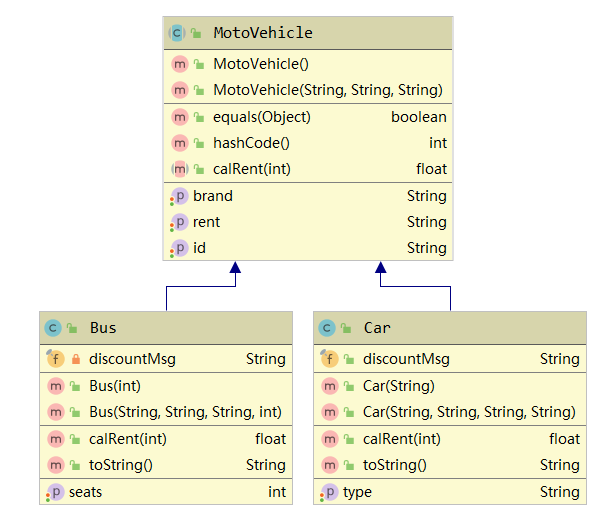


```java
public float calRent(int day): 根据传入的天数计算租金
```

```
brand:品牌
rent:日租金
id: 车牌号
seats:座位数量
type:车的型号
discountMsg:优惠信息
```


#### 3 定义程序入口类，将数据准备好

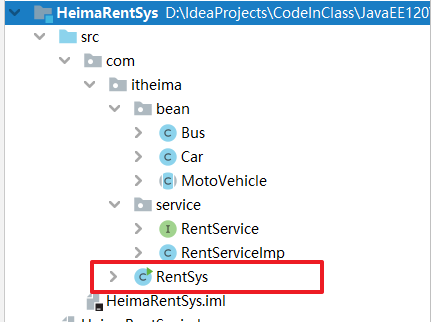

```java
public class RentSys {
    //TODO 第二部分 : 定义存储所有车的容器
    /*
        HashMap<String , HashMap<String , ArrayList<String>>> :
        HashMap的键为 :  String代表的是车的类别(轿车||客车)
        HashMap的值为 :  HashMap<String , ArrayList<String> 此类别车的容器

        HashMap<String , ArrayList<String>
        HashMap的键为 : String品牌
        HashMap的值为 : ArrayList<String> 此品牌的所有车
     */
    public static HashMap<String, HashMap<String, ArrayList<MotoVehicle>>> datas = new HashMap<>();
    // 以租借的车容器
    public static ArrayList<MotoVehicle> rentVehicles = new ArrayList<>();

    static {
        //TODO 第三部分 : 初始化数据
        // 创建存储轿车容器
        HashMap<String, ArrayList<MotoVehicle>> carBrand = new HashMap<>();
        ArrayList<MotoVehicle> daZong = new ArrayList<>();
        daZong.add(new Car("大众", "200", "赣BTK001", "探歌280T"));
        daZong.add(new Car("大众", "300", "赣BTK002", "探歌140T"));
        carBrand.put("大众", daZong);
        ArrayList<MotoVehicle> benChi = new ArrayList<>();
        benChi.add(new Car("奔驰", "400", "沪BTK111", "2021 c 200"));
        benChi.add(new Car("奔驰", "500", "沪BTK222", "2021 c 260"));
        carBrand.put("奔驰", benChi);

        // 创建存储客车的容器
        HashMap<String, ArrayList<MotoVehicle>> busBrand = new HashMap<>();
        ArrayList<MotoVehicle> shenWo = new ArrayList<>();
        shenWo.add(new Bus("申沃", "1500", "沪BTK666", 50));
        shenWo.add(new Bus("申沃", "2500", "沪BTK888", 60));
        busBrand.put("申沃", shenWo);

        datas.put("轿车", carBrand);
        datas.put("客车", busBrand);
    }


    public static void main(String[] args) {
        System.out.println("********************欢迎来到黑马租车***********************");
    }
}
```


#### 4 按需求定义业务功能接口(业务规范)

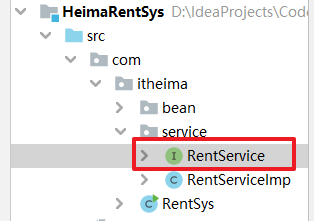 

```java
package com.itheima.service;

public interface RentService {
    void rentFlower();//租车流程

    void returnFlower();//归还流程
}

```


#### 5 实现业务接口的功能

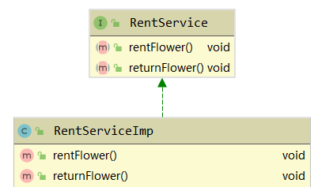 


具体的方法实现今天同学们要进行按照设计文档进行实现。


#### 6 在入口类中将业务调用执行

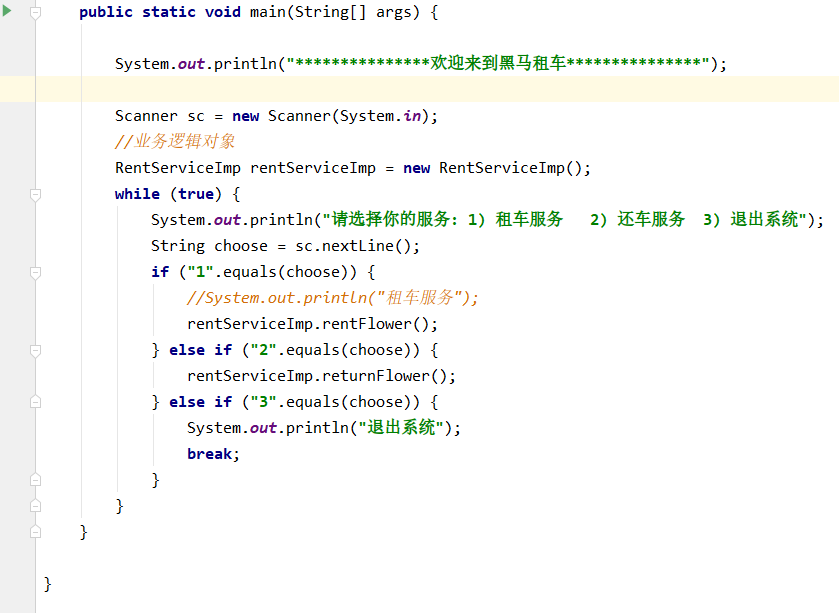 


### 3.3 参考代码

#### 3.1 MotoVehicle类

```java
package com.itheima.bean;

import java.util.Objects;

public abstract class MotoVehicle {
    private String rent; //租金
    private String brand;//品牌
    private String id;   //车牌

    public MotoVehicle() {
    }

    public MotoVehicle(String rent, String brand, String id) {
        this.rent = rent;
        this.brand = brand;
        this.id = id;
    }

    public String getRent() {
        return rent;
    }

    public void setRent(String rent) {
        this.rent = rent;
    }

    public String getBrand() {
        return brand;
    }

    public void setBrand(String brand) {
        this.brand = brand;
    }

    public String getId() {
        return id;
    }

    public void setId(String id) {
        this.id = id;
    }


    //车牌ID如果一样，认为是相同的车
    @Override
    public boolean equals(Object o) {
        if (this == o) return true;
        if (o == null || getClass() != o.getClass()) return false;
        MotoVehicle that = (MotoVehicle) o;
        return Objects.equals(id, that.id);
    }

    @Override
    public int hashCode() {
        return Objects.hash(id);
    }

    /**
     *
     * @param days 天数
     * @return 租金
     */
    public abstract float calRent(int days);
    
}

```

#### 3.2 Car类

```	java
package com.itheima.bean;

public class Car extends MotoVehicle {
    private String type;//车型
    public final String discountMsg = "租车超过7天九折优惠，超过30天八折优惠，超过150天五折优惠。";

    public Car(String type) {
        this.type = type;
    }

    public Car(String rent, String brand, String id, String type) {
        super(rent, brand, id);
        this.type = type;
    }

    public String getType() {
        return type;
    }

    public void setType(String type) {
        this.type = type;
    }

    @Override
    public float calRent(int days) {
        //折扣优惠:租车超过7天九折优惠，超过30天八折优惠，超过150天五折优惠。
        int money = Integer.parseInt(getRent()) * days;
        if (days < 0) {
            throw new RuntimeException("出错");
        } else if (days <= 7) {
            return money;
        } else if (days <= 30) {
            return money * 0.9f;
        } else if (days <= 150) {
            return money * 0.8f;
        } else {
            return money * 0.5f;
        }

    }

    @Override
    public String toString() {
        return getBrand() + " " + getType() +
                ",车牌号为：" + getId() +
                ",租金每天" + getRent() + "元, " + discountMsg;
    }
}

```

#### 3.3 Bus类

```java
public class Car extends MotoVehicle {
    private String type;// 型号
    public static final String disCount = "租车超过3天九折，超过7天八折，超过30天七折，超过150天五折";

    // 空参构造
    public Car() {
    }

    // 有参构造
    public Car(String brand, String rent, String id, String type) {
        super(brand, rent, id);
        this.type = type;
    }

    public String getType() {
        return type;
    }

    public void setType(String type) {
        this.type = type;
    }

    public String getDisCount() {
        return disCount;
    }


    /*
        此方法接收一个日期 , 返回的是租金
        租车超过3天九折，超过7天八折，超过30天七折，超过150天五折
     */
    @Override
    public float calRent(int day) {
        // 定义租金变量
        float result;
        if (day > 3 && day <= 7) {
            // 获取当前租金,转成小数
            result = Float.parseFloat(getRent()) * 0.9F;
        }else if(day > 7 && day <= 30){
            result = Float.parseFloat(getRent()) * 0.7F;
        }else if(day > 150){
            result = Float.parseFloat(getRent()) * 0.5F;
        }else {
            result = Float.parseFloat(getRent());
        }
        return result;
    }
}
```


#### 3.4 RentService业务接口

```java
public interface RentService {
    void rentFlower();//租车流程

    void returnFlower();//归还流程
}
```

#### 3.5 RentServiceImp 业务实现类

```java
public class RentServiceImp implements RentService {
    public static HashMap<String, HashMap<String, ArrayList<MotoVehicle>>> datas = RentSys.datas;
    Scanner sc = new Scanner(System.in);
    String type;// 键盘录入租车的类型(轿车 || 客车)

    @Override
    public void rentFlower() {
        //TODO 第四部分 : 完成租车业务逻辑
        System.out.println("请选择你要租车的类别:");
        System.out.println("当前有汽车类别:" + datas.keySet());

        // 死循环的目的 :
        // 1 当选择正确的选项 , 那么停止循环
        // 2 如果选择不是轿车或者客车 , 那么死循环直到录入正确为止
        while (true) {
            // 键盘录入的车的类型 : 轿车或者客车
            type = sc.nextLine();
            if (type.equals("轿车") || type.equals("客车")) {
                break;
            } else {
                System.out.println("请输入的选项不存在, 请重新输入....");
            }
        }
        /*
            1 如果代码执行到此位置 , 说明录入的车的类型已经存在
                在根据车的类型获取对应的Map集合
            2 获取的Map集合键存储的是品牌 , 值存储的是当前品牌下的所有的车
         */
        HashMap<String, ArrayList<MotoVehicle>> hm = datas.get(type);

        // 存储所有的当前类型车的所有品牌
        Set<String> brands = hm.keySet();
        System.out.println("您选择的" + type + "有如下的品牌:" + brands);

        // 判断键盘录入的品牌是否存在 , 不存在继续录入 , 存在停止死循环
        String brand;// 记录键盘录入的品牌
        while (true) {
            // 键盘录入选择当前车的品牌 : 例如 奔驰 , 大众
            brand = sc.nextLine();
            // 记录当前键盘录入的品牌是否存在
            //  true存在 , false不存在
            boolean flag = false;
            for (String setBrand : brands) {
                if (setBrand.equals(brand)) {
                    flag = true;
                }
            }
            if (flag) {
                // 存在,把死循环停掉
                break;
            } else {
                // 不存在, 给出提示 , 继续循环
                System.out.println("您录入的品牌不存在 , 请重新录入...");
            }
        }

        // 获取当前品牌对应的集合容器
        ArrayList<MotoVehicle> motoVehicles = hm.get(brand);

        // 判断此品牌的车是否还有剩余
        if (motoVehicles.isEmpty()) {
            System.out.println("抱歉,该品牌" + brand + "的车没有剩余!");
            return;// 结束当前方法
        } else {
            System.out.println("当前品牌下的车如下:");
            for (int i = 0; i < motoVehicles.size(); i++) {
                MotoVehicle motoVehicle = motoVehicles.get(i);
                // 用方法改进 , 显示当前车的信息
                showVehicles(motoVehicle, i);
            }
        }

        System.out.print("请输入您需要车型对应的序号:");
        String id = sc.nextLine();// 键盘录入当前车型的序号
        MotoVehicle motoVehicle = motoVehicles.get(Integer.parseInt(id));

        // 用方法改进 , 显示当前车的信息
        showVehicles(motoVehicle, 0);

        System.out.println("请输入您要租借的天数:");
        String day = sc.nextLine();

        // 调用calRent计算 , 此方法在机动车类(父类)中已有定义
        float money = motoVehicle.calRent(Integer.parseInt(day));

        System.out.println("尊敬的顾客,您此次租的车是" + brand + ",车牌为" +
                motoVehicle.getId() + "租借时间为" + day + "天,租金为" + money + "元,祝你把妹开心!");

        // 租借成功 , 应该把集合中的车移除
        RentSys.datas.get(type).get(brand).remove(motoVehicle);
        // 把租到的车存到已租到车的容器中
        RentSys.rentVehicles.add(motoVehicle);
    }

    @Override
    public void returnFlower() {
        //TODO 第五部分 : 完成还车业务逻辑
        // 获取已经租到车的容器
        ArrayList<MotoVehicle> rentVehicles = RentSys.rentVehicles;

        // 容器为空, 说明当前还没有租到车
        if (rentVehicles.isEmpty()) {
            System.out.println("您还没有进行租车,无法归还...");
            return;
        }

        // 代码走到此位置 , 已租到车
        System.out.println("当前已租到的车:");
        for (int i = 0; i < rentVehicles.size(); i++) {
            MotoVehicle motoVehicle = rentVehicles.get(i);
            // 展示已经租到的车
            showVehicles(motoVehicle, i);
        }

        System.out.println("请输入您要归还车的编号:");
        String rentId = sc.nextLine();

        while (true) {
            // 输入的编号,在集合索引范围之内 , 那么输入的编号存在
            // 举例 : 如果租到两辆车那么存储以租车的集合长度为2,索引是[0-1] , 对应的编号也是[0-1]
            if (Integer.parseInt(rentId) >= 0 && Integer.parseInt(rentId) < rentVehicles.size()) {
                break;
            } else {
                System.out.println("您输入编号不存在 , 请重新输入....");
            }
        }

        // 代码走到此位置 , 说明录入编号存在
        // 获取当前要归还的车
        MotoVehicle motoVehicle = rentVehicles.get(Integer.parseInt(rentId));
        // 获取归还车的品牌
        String brand = motoVehicle.getBrand();
        // 把归还的车添加到存储所有的车的容器
        RentSys.datas.get(type).get(brand).add(motoVehicle);
        // 已租到的车的容器进行删除此车
        RentSys.rentVehicles.remove(motoVehicle);
        System.out.println("归还成功!");
    }

    // 传入一辆车 , 展示此车的所有信息
    public void showVehicles(MotoVehicle motoVehicle, int index) {
        if (motoVehicle instanceof Car) {
            Car car = (Car) motoVehicle;
            System.out.println("[" + index + "]" + type + "信息如下:" + car.getBrand() + car.getType()
                    + ",车牌号为:" + car.getId() + ",租金每天:" + car.getRent() + "元");
        } else if (motoVehicle instanceof Bus) {
            Bus bus = (Bus) motoVehicle;
            System.out.println("[" + index + "]" + type + "信息如下:" + bus.getBrand() + ",座位为:" + bus.getSeats()
                    + ",车牌号为:" + bus.getId() + ",租金每天:" + bus.getRent() + "元");
        }
    }
}

```


#### 3.6 RentSys 程序入口主类

```java
public class RentSys {
    //TODO 第二部分 : 定义存储所有车的容器
    /*
        HashMap<String , HashMap<String , ArrayList<String>>> :
        HashMap的键为 :  String代表的是车的类别(轿车||客车)
        HashMap的值为 :  HashMap<String , ArrayList<String> 此类别车的容器

        HashMap<String , ArrayList<String>
        HashMap的键为 : String品牌
        HashMap的值为 : ArrayList<String> 此品牌的所有车
     */
    public static HashMap<String, HashMap<String, ArrayList<MotoVehicle>>> datas = new HashMap<>();
    // 以租借的车容器
    public static ArrayList<MotoVehicle> rentVehicles = new ArrayList<>();

    static {
        //TODO 第三部分 : 初始化数据
        // 创建存储轿车容器
        HashMap<String, ArrayList<MotoVehicle>> carBrand = new HashMap<>();
        ArrayList<MotoVehicle> daZong = new ArrayList<>();
        daZong.add(new Car("大众", "200", "赣BTK001", "探歌280T"));
        daZong.add(new Car("大众", "300", "赣BTK002", "探歌140T"));
        carBrand.put("大众", daZong);
        ArrayList<MotoVehicle> benChi = new ArrayList<>();
        benChi.add(new Car("奔驰", "400", "沪BTK111", "2021 c 200"));
        benChi.add(new Car("奔驰", "500", "沪BTK222", "2021 c 260"));
        carBrand.put("奔驰", benChi);

        // 创建存储客车的容器
        HashMap<String, ArrayList<MotoVehicle>> busBrand = new HashMap<>();
        ArrayList<MotoVehicle> shenWo = new ArrayList<>();
        shenWo.add(new Bus("申沃", "1500", "沪BTK666", 50));
        shenWo.add(new Bus("申沃", "2500", "沪BTK888", 60));
        busBrand.put("申沃", shenWo);

        datas.put("轿车", carBrand);
        datas.put("客车", busBrand);
    }


    public static void main(String[] args) {
        System.out.println("********************欢迎来到黑马租车***********************");
        Scanner sc = new Scanner(System.in);
        //创建业务类的对象
        RentServiceImp rentServiceImp = new RentServiceImp();
        while (true) {
            System.out.println("请选择您的服务：1）租车服务 2）还车服务  3）退出系统");
            String choose = sc.nextLine();
            switch (choose) {
                case "1":
                    //租车
                    rentServiceImp.rentFlower();
                    break;
                case "2":
                    //还车
                    rentServiceImp.returnFlower();
                    break;
                case "3":
                    System.out.println("欢迎下次光临！！");
                    System.exit(0);
                    break;
                default:
                    System.out.println("功能不存在，请重新输入！");
            }
        }
    }
}
```


