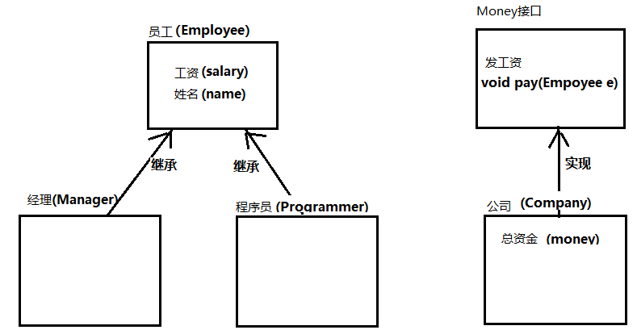

```java
作业规范【必读】

命名要求：
	1. 类名，接口名，枚举名，注解名使用大驼峰
	2. 变量名，方法名，包名均使用小驼峰
	3. 常量名全大写，多个单词下划线分割
	4. 名字要见名知意，如果不知道对应的英文，可以使用拼音代替。不可使用无意义字符
  
代码规范：
	格式要良好，使用IDEA格式化缩进（快捷键：Ctrl+Alt+L）
  
答题规范：
	1. 每道题完整代码请贴入对应题目中的代码区。
    2. 如果有运行结果的，请把代码运行结果放到文档中
```


# 【多态】

## 题目1

有以下类定义：

动物类

```
属性：名称、年龄、性别
行为：吃
```

猫类继承动物

```java
行为：
  吃（重写）
  捉老鼠
```

狗类继承动物

```java
行为：
  吃（重写）
  看家
```


**要求**

请按要求定义上述类，并用多态的格式测试调用“吃饭”和“捉老鼠”的方法，看看有什么特点？


**答案：**

- 多态访问特点是什么？

  ```java
  多态访问方法 : 编译看左边 , 执行看右边
  多态不能访问子类特有功能 , 需要向下转型
  ```
  
- 代码

  ```java
  package com.itheima.homework;
  
  /*
      有以下类定义：
  
      动物类
      属性：名称、年龄、性别
      行为：吃
  
  
      猫类继承动物
      行为：
        吃（重写）
        捉老鼠
  
      狗类继承动物
      行为：
        吃（重写）
        看家
  
      请按要求定义上述类，并用多态的格式测试调用“吃饭”和“捉老鼠”的方法，看看有什么特点？
  
  
   */
  public class Test1 {
      public static void main(String[] args) {
          Animal cat = new Cat();
          cat.eat();
          ((Cat) cat).catchMouse();
  
          Animal dog = new Dog();
          dog.eat();
          ((Dog) dog).lookHome();
      }
  }
  
  /*
      动物类
      属性：名称、年龄、性别
      行为：吃
   */
  abstract class Animal {
      private String breed;
      private int age;
      private String sex;
  
      public Animal() {
      }
  
      public Animal(String breed, int age, String sex) {
          this.breed = breed;
          this.age = age;
          this.sex = sex;
      }
  
      public String getBreed() {
          return breed;
      }
  
      public void setBreed(String breed) {
          this.breed = breed;
      }
  
      public int getAge() {
          return age;
      }
  
      public void setAge(int age) {
          this.age = age;
      }
  
      public String getSex() {
          return sex;
      }
  
      public void setSex(String sex) {
          this.sex = sex;
      }
  
      public abstract void eat();
  }
  
  class Cat extends Animal {
  
      public Cat() {
      }
  
      public Cat(String breed, int age, String sex) {
          super(breed, age, sex);
      }
  
      @Override
      public void eat() {
          System.out.println("猫吃鱼...");
      }
  
      public void catchMouse() {
          System.out.println("抓老鼠..");
      }
  }
  
  class Dog extends Animal {
      public Dog() {
      }
  
      public Dog(String breed, int age, String sex) {
          super(breed, age, sex);
      }
  
      @Override
      public void eat() {
          System.out.println("狗吃骨头");
      }
  
      public void lookHome() {
          System.out.println("狗看家...");
      }
  }
  ```
  
  


## 题目2

**知识点涉及：**

1、继承，接口，多态


**需求：**

模拟公司给员工发工资，代码实现，执行效果如图所示：

 


参考下面的继承结构图完成相关代码的设计：

1、程序员和经理都属于员工，使用继承完成相关类的设计

2、员工作为父类，为其提供带参的构造函数，子类的有参构造需调用父类的有参构造

3、创建接口Money，定义发工资功能，为员工发工资。

4、公司类中定义总资金属性，实现Money接口，通过总资金扣除员工的工资，得出发工资后工资剩余的总资金

5、创建测试类，在main方法中创建经理对象，程序员对象，及公司对象。调用方法给经理和程序员发工资。




**答案：**

```java
package com.itheima.homework.test2;

public interface Money {
    public abstract void pay(Employee employee);
}

```

```java
package com.itheima.homework.test2;

public class Employee {
    private double salary;
    private String name;

    public Employee() {
    }

    public Employee(double salary, String name) {
        this.salary = salary;
        this.name = name;
    }

    public double getSalary() {
        return salary;
    }

    public void setSalary(double salary) {
        this.salary = salary;
    }

    public String getName() {
        return name;
    }

    public void setName(String name) {
        this.name = name;
    }
}

```

```java
package com.itheima.homework.test2;

// 公司类 实现类 发工资接口
public class Company implements Money {
    private double money ;

    public Company() {

    }

    public Company(double money) {
        this.money = money;
    }

    public double getMoney() {
        return money;
    }

    public void setMoney(double money) {
        this.money = money;
    }

    @Override
    public void pay(Employee employee) {
        System.out.println("给" + employee.getName() + "发工资" + employee.getSalary() + "元,公司剩余" + (money - employee.getSalary()) + "元");
        // 从公司总资金中扣除当前员工的工资
        money -= employee.getSalary();
    }
}

```

```java
package com.itheima.homework.test2;

public class Programmer extends Employee {
    public Programmer() {
    }

    public Programmer(double salary, String name) {
        super(salary, name);
    }
}

```

```java
package com.itheima.homework.test2;

public class Manager extends Employee{

    public Manager() {
    }

    public Manager(double salary, String name) {
        super(salary, name);
    }
}
```

```java
package com.itheima.homework.test2;

import java.util.Properties;

/*
    模拟公司给员工发工资，代码实现，执行效果如图所示：


    参考下面的继承结构图完成相关代码的设计：
    1、程序员和经理都属于员工，使用继承完成相关类的设计

    2、员工作为父类，为其提供带参的构造函数，子类的有参构造需调用父类的有参构造

    3、创建接口Money，定义发工资功能，为员工发工资。

    4、公司类中定义总资金属性，实现Money接口，通过总资金扣除员工的工资，得出发工资后工资剩余的总资金

    5、创建测试类，在main方法中创建经理对象，程序员对象，及公司对象。调用方法给经理和程序员发工资。
*/
public class Test2 {
    public static void main(String[] args) {
        Company company = new Company(1000000);
        Programmer programmer = new Programmer(10000, "张三");
        Manager manager = new Manager(20000, "李四");

        company.pay(programmer);
        company.pay(manager);
    }
}
```


**执行结果：**

```java
给张三发工资10000.0元,公司剩余990000.0元
给李四发工资20000.0元,公司剩余970000.0元
```


# 【内部类】

## 题目3

分析下面“成员内部类”程序的运行结果：

```java
public class Demo{
    public static void main(String[] args){
        Outer.Inner obj = new Outer().new Inner();
        obj.show();
    }
}
class Outer{
    public int number = 10;
    class Inner{
        public int number = 20;
        public void show(){
            int number =30;
            System.out.println(number);
            System.out.println(this.number);
            System.out.println(Outer.this.number);
        }
    }
}
```


答案：

```java
30
20
10
```


# 【Object】

## 题目4

请按标准格式定义一个“学生类”，它有三个属性：姓名、性别、年龄。

要求：在测试类主方法中完成

1. 创建学生对象打印对象时，不再是地址，而是能够将对象的属性内容打印出来。
2. 两个学生类的对象比较时，要求姓名，性别，年龄属性值相同即认为这两个学生对象是相同的。


**答案：**

```java
package com.itheima.homework.test4;

public class Student {
    private String name;
    private String sex;
    private int age;


    public Student() {
    }

    public Student(String name, String sex, int age) {
        this.name = name;
        this.sex = sex;
        this.age = age;
    }

    public String getName() {
        return name;
    }

    public void setName(String name) {
        this.name = name;
    }

    public String getSex() {
        return sex;
    }

    public void setSex(String sex) {
        this.sex = sex;
    }

    public int getAge() {
        return age;
    }

    public void setAge(int age) {
        this.age = age;
    }

    @Override
    public String toString() {
        return "Student{" +
                "name='" + name + '\'' +
                ", sex='" + sex + '\'' +
                ", age=" + age +
                '}';
    }

    @Override
    public boolean equals(Object o) {
        if (this == o) return true;
        if (o == null || getClass() != o.getClass()) return false;

        Student student = (Student) o;

        if (age != student.age) return false;
        if (name != null ? !name.equals(student.name) : student.name != null) return false;
        return sex != null ? sex.equals(student.sex) : student.sex == null;
    }


}

```

```java
package com.itheima.homework.test4;
/*
    请按标准格式定义一个“学生类”，它有三个属性：姓名、性别、年龄。

    要求：在测试类主方法中完成

    1. 创建学生对象打印对象时，不再是地址，而是能够将对象的属性内容打印出来。
    2. 两个学生类的对象比较时，要求姓名，性别，年龄属性值相同即认为这两个学生对象是相同的。


 */
public class Test4 {
    public static void main(String[] args) {
        Student s1 = new Student("柳岩" , "女" , 18);
        System.out.println(s1);

        Student s2 = new Student("柳岩" , "女" , 18);
        System.out.println(s1.equals(s2));
    }
}

```


# 【Date，DateFormat】

## 题目5

请编写程序，从控制台接收一个“生日”，格式：yyyy-MM-dd，程序要能够计算并打印他来到世界xx天。

**注意：“生日”必须早于“当前日期”，否则提示：生日必须早于当前日期！**

**答案：**

```java
package com.itheima.homework.test5;

import java.text.ParseException;
import java.text.SimpleDateFormat;
import java.util.Date;
import java.util.Scanner;

/*
    请编写程序，从控制台接收一个“生日”，格式：yyyy-MM-dd，程序要能够计算并打印他来到世界xx天。

    注意：“生日”必须早于“当前日期”，否则提示：生日必须早于当前日期！
 */
public class Test5 {
    public static void main(String[] args) throws ParseException {

        Scanner sc = new Scanner(System.in);
        System.out.println("生日(yyyy-MM-dd):");
        String birthday = sc.nextLine();

        SimpleDateFormat sdf = new SimpleDateFormat("yyyy-MM-dd");
        Date date = sdf.parse(birthday);
        long startTime = date.getTime();

        Date date1 = new Date();
        long endTime = date1.getTime();

        System.out.println("来到世界"+(endTime-startTime)/(1000L*60*60*24)+"天");

    }
}

```


## 题目6

获取当前系统的时间，以“xxxx年xx月xx日 xx时xx分xx秒”的格式打印出来。

**答案：**

```java
package com.itheima.homework.test6;

import java.text.SimpleDateFormat;
import java.util.Date;

/*
    获取当前系统的时间，以“xxxx年xx月xx日 xx时xx分xx秒”的格式打印出来
 */
public class Test6 {
    public static void main(String[] args) {
        Date d = new Date();

        SimpleDateFormat sdf = new SimpleDateFormat("yyyy年MM月dd日 HH时mm分ss秒");
        // 格式化 : Date --> String
        String strDate = sdf.format(d);

        System.out.println(strDate);
    }
}

```


# 【Calendar】

## 题目7

请编写程序，使用Calendar类获取日历对象，并分别获取年、月、日、小时、分、秒，星期信息并将它们打印到控制台。


**答案：**

```java
package com.itheima.homework.test7;

import java.util.Calendar;

public class Test7 {
    public static void main(String[] args) {
        // 拿到当前时间
        Calendar now = Calendar.getInstance();

        System.out.println(now.get(Calendar.YEAR));
        System.out.println(now.get(Calendar.MONTH));
        System.out.println(now.get(Calendar.DAY_OF_MONTH));
        System.out.println(now.get(Calendar.HOUR));
        System.out.println(now.get(Calendar.MINUTE));
        System.out.println(now.get(Calendar.SECOND));

        int week = now.get(Calendar.DAY_OF_WEEK);// 7
        System.out.println(getWeek(week));// 字段值
    }

    public static String getWeek(int field){
        String[] str = { "" , "SUNDAY" , "MONDAY" , "TUESDAY" , "WEDNESDAY" , "THURSDAY" , "FRIDAY" , "SATURDAY"};
        return str[field];
    }
}

```


# 【Math】

## 题目8

   请编程进行以下运算：

- 请计算3的5次幂
- 请计算3.2向上取整的结果
- 请计算3.8向下取整的结果
- 请计算5.6四舍五入取整的结果


**答案：**

```java

```

