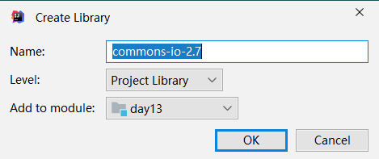

# day12-编码表,字符流,对象流,其他流

## 今日目标

- ##### 编码表

- ##### 字符输出流

- ##### 字符输入流

- ##### 字符缓冲流

- ##### 转换流

- ##### 对象操作流

- ##### 装饰模式

- ##### commons-iojar包

## 1 编码表

### 1.1 思考：

- 既然字节流可以操作所有文件，那么为什么还要学习字符流 ？
  - 如果使用字节流 , 把文本文件中的内容读取到内存时, 可能会出现乱码
  - 如果使用字节流 , 把中文写入文本文件中 , 也有可能会出现乱码

### 1.2 编码表介绍

- 计算机中储存的信息都是用二进制数据表示的；我们在屏幕上看到的英文、汉字等字符是二进制数转换之后的结果

- 按照编码表规则，将字符存储到计算机中，称为编码。

- 按照同样的编码表规则，将存储在计算机中的二进制数据解析显示出来，称为解码 。

- 编码和解码使用的码表必须一致，否则会导致乱码。

- ##### 简单理解：

  - 存储一个字符a，首先需在码表中查到对应的数字是97，然后按照转换成二进制的规则进行存储。称为编码    
  - 读取的时候，先把二进制解析出来，再转成97，通过97查找早码表中对应的字符是a。称为解码

- ##### ASCII码表：

  - ASCII(American Standard Code for Information Interchange，美国信息交换标准码表)：
  - 包括了数字字符，英文大小写字符和一些常见的标点符号字符。
  - 注意：ASCII码表中是没有中文的。

  

- #####  GBK码表：

  - window系统默认的码表。兼容ASCII码表，也包含了21003个汉字，并支持繁体汉字以及部分日韩文字
  - 注意：GBK是中国的码表，一个中文以两个字节的形式存储。但不包含世界上所有国家的文字。

- ##### Unicode码表：

  - 由国际组织ISO 制定，是统一的万国码表，计算机科学领域里的一项业界标准，容纳世界上大多数国家的所有常见文字和符号。
  - 但是因为表示的字符太多，所以Unicode码表中的数字不是直接以二进制的形式存储到计算机的，会先通过UTF-7，UTF-7.5，UTF-8，UTF-16，以及 UTF-32的编码方式再存储到计算机，其中最为常见的就是UTF-8。
  - 注意： Unicode是万国码表，以UTF-8编码后一个中文以三个字节的形式存储

### 1.3 编码表小结


### 1.4 字节流读中文出现码的原码

- 因为字节流一次读一个字节，而不管GBK还是UTF-8一个中文都是多个字节，用字节流每次只能读其中的一部分，所以就会出现乱码问题

## 2 字符输出流

### 2.1 字符流输出介绍

- ##### Writer类 

  - 写入字符流的最顶层的类 , 是一个抽象类 ,不能实例化 , 需要使用其子类FileWriter类

- ##### FileWriter类  : 用来写入字符文件的便捷类

### 2.2 FileWriter的成员

- 构造方法 : 

  -   public FileWriter(File file) : 往指定的File路径中写入数据
  -   public FileWriter(String fileName) : 往指定的String路径中写入数据

- 成员方法 : 

  - | void write(int c)                         | 写一个字符           |
    | ----------------------------------------- | -------------------- |
    | void write(char[] cbuf)                   | 写入一个字符数组     |
    | void write(char[] cbuf, int off, int len) | 写入字符数组的一部分 |
    | void write(String str)                    | 写一个字符串         |
    | void write(String str, int off, int len)  | 写一个字符串的一部分 |

  - | flush() | 刷新流，还可以继续写数据                                     |
    | ------- | ------------------------------------------------------------ |
    | close() | 关闭流，释放资源，但是在关闭之前会先刷新流。一旦关闭，就不能再写数据 |

### 2.3 FileWriter写数据的步骤

- ##### 1 创建字符输出流对象

  - 注意事项：
           如果文件不存在，就创建。但是要保证父级路径存在。
           如果文件存在就清空

- ##### 2 写数据

  - 注意事项：
           写出int类型的整数，实际写出的是整数在码表上对应的字母。
           写出字符串数据，是把字符串本身原样写出。

- ##### 3 释放资源

  - 注意事项：
           每次使用完流必须要释放资源。

- ```java
  package com.itheima.writer_demo;
  
  import java.io.FileWriter;
  import java.io.IOException;
  
  /*
      Writer类 : 写入字符流的最顶层的类 , 是一个抽象类 ,不能实例化
      需要使用其子类FileWriter类
  
      FileWriter类 : 用来写入字符文件的便捷类
      构造方法 :
          public FileWriter(File file) : 往指定的File路径中写入数据
          public FileWriter(String fileName) : 往指定的String路径中写入数据
      成员方法
          void write​(int c)	写一个字符
          void write​(char[] cbuf)	写入一个字符数组
          void write​(char[] cbuf, int off, int len)	写入字符数组的一部分
          void write​(String str)	写一个字符串
          void write​(String str, int off, int len)	写一个字符串的一部分
          flush()	刷新流，还可以继续写数据
          close()	关闭流，释放资源，但是在关闭之前会先刷新流。一旦关闭，就不能再写数据
   */
  public class WriterDemo1 {
      public static void main(String[] args) throws IOException {
          // 创建字符输出流对象
          // 如果文件不存在会创建一个空的文件
          // 如果文件存在 , 会把文件中的内容清空
          FileWriter fw = new FileWriter("day12_demo\\charstream2.txt");
  
          // 写数据
          fw.write('a');
          fw.write('b');
          // 刷新流 , 把流中的数据刷到硬盘中 , 刷新之后可以继续写数据
          // fw.flush();
  
          // 释放资源
          // 关闭流 , 但是会先刷新流
          fw.close();
          // 一旦关闭流无法写数据
          // fw.write('c');
      }
  }
  
  ```

  ```java
  package com.itheima.writer_demo;
  
  import java.io.FileWriter;
  import java.io.IOException;
  
  /*
      Writer类 : 写入字符流的最顶层的类 , 是一个抽象类 ,不能实例化
      需要使用其子类FileWriter类
  
      FileWriter类 : 用来写入字符文件的便捷类
      构造方法 :
          public FileWriter(File file) : 往指定的File路径中写入数据
          public FileWriter(String fileName) : 往指定的String路径中写入数据
      成员方法
          void write​(int c)	写一个字符
          void write​(char[] cbuf)	写入一个字符数组
          void write​(char[] cbuf, int off, int len)	写入字符数组的一部分
          void write​(String str)	写一个字符串
          void write​(String str, int off, int len)	写一个字符串的一部分
          flush()	刷新流，还可以继续写数据
          close()	关闭流，释放资源，但是在关闭之前会先刷新流。一旦关闭，就不能再写数据
   */
  public class WriterDemo2 {
      public static void main(String[] args) throws IOException {
          // 创建字符输出流对象
          FileWriter fw = new FileWriter("day12_demo\\charstream2.txt");
  
          // 写数据
  //        void write​(int c)	写一个字符
  //        fw.write('a');
  //        fw.write('b');
  //        fw.write('c');
  
  //        void write​(char[] cbuf)	写入一个字符数组
          char[] chs = {'a', 'b', 'c', 'd', 'e'};
  //        fw.write(chs);
  
  //        void write​(char[] cbuf, int off, int len)	写入字符数组的一部分
  //        fw.write(chs , 2 , 3);
  
  //        void write​(String str)	写一个字符串
  //        fw.write("abcadaasda");
  
  //        void write​(String str, int off, int len)	写一个字符串的一部分
  //        fw.write("abnacna", 3, 2);
  
          // 释放资源
          fw.close();
      }
  }
  
  ```

### 2.4 字符输出流练习

- ```java
  package com.itheima.writer_demo;
  
  import java.io.FileWriter;
  import java.io.IOException;
  import java.util.Scanner;
  
  /*
      需求 : 将用户键盘录入的用户名和密码保存到本地实现永久化存储。
      要求 : 用户名和密码在文件中各占一行
  
      步骤：
          1 用户键盘录入用户名
          2 创建字符输出流对象
          3 将用户名和密码写到本地文件中
   */
  public class WriterTest {
      public static void main(String[] args) throws IOException {
          Scanner sc = new Scanner(System.in);
          System.out.println("请输入用户名:");
          String username = sc.nextLine();
  
          System.out.println("请输入密码:");
          String password = sc.nextLine();
  
          // 创建字符输出流对象
          FileWriter fw = new FileWriter("day12_demo\\user.txt");
          // 往文件中写入用户名和密码
          fw.write(username);
          // 换行
          fw.write("\r\n");
          fw.write(password);
          // 刷新
          fw.flush();
          // 释放资源
          fw.close();
      }
  }
  
  ```

## 3 字符输入流

### 3.1 字节输入流介绍

- Reader类 : 
  - 读取字符流的最顶层的类 , 是一个抽象类 ,不能实例化
  - 需要使用其子类FileReader类
- FileReader类 : 
  - 用来读取字符文件的便捷类

### 3.2  FileReader的成员

- 构造方法 :
  - public FileReader(File file) : 从指定的File路径中读取数据
  - public FileReader(String fileName) : 从指定的String路径中读取数据

- 成员方法 :

  - | int read()            | 一次读一个字符数据     |
    | --------------------- | ---------------------- |
    | int read(char[] cbuf) | 一次读一个字符数组数据 |

- ```java
  package com.itheima.reader_demo;
  
  import java.io.FileNotFoundException;
  import java.io.FileReader;
  import java.io.IOException;
  
  /*
      Reader类 : 读取字符流的最顶层的类 , 是一个抽象类 ,不能实例化
      需要使用其子类FileReader类
  
      FileReader类 : 用来读取字符文件的便捷类
  
      构造方法 :
          public FileReader(File file) : 从指定的File路径中读取数据
          public FileReader(String fileName) : 从指定的String路径中读取数据
  
      成员方法 :
          int read​() : 一次读一个字符数据
          int read​(char[] cbuf)	 : 一次读一个字符数组数据
   */
  public class ReaderDemo1 {
      public static void main(String[] args) throws IOException {
          // 创建字符输入流对象
          FileReader fr = new FileReader("day12_demo\\charstream.txt");
  
          // 一次读一个字符数据
          int ch;
          while ((ch = fr.read()) != -1) {
              System.out.print((char) ch);
          }
  
          // 释放资源
          fr.close();
      }
  }
  
  ```

- ```java
  package com.itheima.reader_demo;
  
  import java.io.FileNotFoundException;
  import java.io.FileReader;
  import java.io.IOException;
  
  /*
      Reader类 : 读取字符流的最顶层的类 , 是一个抽象类 ,不能实例化
      需要使用其子类FileReader类
  
      FileReader类 : 用来读取字符文件的便捷类
  
      构造方法 :
          public FileReader(File file) : 从指定的File路径中读取数据
          public FileReader(String fileName) : 从指定的String路径中读取数据
  
      成员方法 :
          int read​()	一次读一个字符数据
          int read​(char[] cbuf)	一次读一个字符数组数据
   */
  public class ReaderDemo2 {
      public static void main(String[] args) throws IOException {
          // 创建字符输入流对象
          FileReader fr = new FileReader("day12_demo\\charstream.txt");
  
          // 一次读一个字符数组数据
          char[] chs = new char[1024];
          int len;
          while ((len = fr.read(chs)) != -1) {
              System.out.println(new String(chs, 0, len));
          }
          // 释放资源
          fr.close();
      }
  }
  
  ```

## 4 字符缓冲流

### 4.1 字符缓冲流

- BufferedWriter：可以将数据高效的写出
- BufferedReader：可以将数据高效的读入到内存
- 注意 :  字符缓冲流不具备读写功能 , 只提供缓冲区 , 真正读写还是需要依赖于构造接收的基本的字符流
- 构造方法：
  -   public  BufferedWriter(Writer out) : 构造方法中需要接收一个基本的字符输出流
  -   public BufferedReader(Reader in) : 构造方法中需要接收一个基本的字符输入流

```
package com.itheima.bufferedstream_demo;

import java.io.*;

/*
    需求 : 使用字符缓冲流复制纯文本文件
    将当日课程资料中的 ‘斗罗大陆.txt’ 复制到当前模块下 'copy.txt'
 */
public class BufferedStreamDemo1 {
    public static void main(String[] args) throws IOException {
        // 创建高效的字符输入流对象
        BufferedReader br = new BufferedReader(new FileReader("D:\\传智播客\\上海-JavaSE进阶面授\\day12【缓冲流、转换流、序列化流、装饰者模式、commons-io工具包】\\资料\\斗罗大陆.txt"));
        // 创建高效的字符输出流对象
        BufferedWriter bw = new BufferedWriter(new FileWriter("day12_demo\\copy.txt"));

        // 一次读写一个字符
//        int ch;
//        while ((ch = br.read()) != -1) {
//            bw.write(ch);
//        }

        // 一次读写一个字符数组
        char[] chs = new char[1024];
        int len;
        while ((len = br.read(chs)) != -1) {
            bw.write(chs, 0, len);
        }
        // 释放资源
        br.close();
        bw.close();
    }
}
```

### 4.2 字符缓冲流特有的功能

- ##### BufferedWriter类

  - void newLine()：写一个行分隔符，会根据操作系统的不同,写入不同的行分隔符

- ##### BufferedReader类

  - public String readLine() ：读取文件一行数据, 不包含换行符号 ,  读到文件的末尾返回null

- ```java
  package com.itheima.bufferedstream_demo;
  
  import java.io.*;
  
  /*
      1 字符缓冲流：
          BufferedWriter：可以将数据高效的写出
          BufferedReader：可以将数据高效的读入到内存
  
      2 字符缓冲流特有功能
          BufferedWriter类
              void newLine​()：写一个行分隔符，会根据操作系统的不同,写入不同的行分隔符
          BufferedReader类
              public String readLine​() ：读取文件一行数据, 不包含换行符号 ,  读到文件的末尾返回null
  
          远桥之下泛莲舟
          岱岩石上松溪流
          万仞翠山梨亭在
          莫闻空谷声悠悠
   */
  public class BufferedStreamDemo2 {
      public static void main(String[] args) throws IOException {
  
          // 创建高效的字符输出流对象
          BufferedWriter bw = new BufferedWriter(new FileWriter("day12_demo\\abc.txt"));
          // void newLine​()：写一个行分隔符，会根据操作系统的不同,写入不同的行分隔符
          bw.write("远桥之下泛莲舟");
          bw.newLine();
          bw.write("岱岩石上松溪流");
          bw.newLine();
          bw.write("万仞翠山梨亭在");
          bw.newLine();
          bw.write("莫闻空谷声悠悠");
          bw.flush();
  
          // 创建高效的字符输入流对象
          BufferedReader br = new BufferedReader(new FileReader("day12_demo\\abc.txt"));
          // public String readLine​() ：读取文件一行数据, 不包含换行符号 ,  读到文件的末尾返回null
  //        String s = br.readLine();
  //        System.out.println(s);
  //        s = br.readLine();
  //        System.out.println(s);
  //        s = br.readLine();
  //        System.out.println(s);
  //        s = br.readLine();
  //        System.out.println(s);
  //        System.out.println("============");
  //        s = br.readLine();
  //        System.out.println(s);
  //        s = br.readLine();
  //        System.out.println(s);
  
          // 循环改进
          String line;
          while((line = br.readLine()) != null){
              System.out.println(line);
          }
  
          // 释放资源
          br.close();
          bw.close();
      }
  }
  
  ```

### 4.3 字符缓冲流练习

```
package com.itheima.bufferedstream_demo;

import java.io.*;
import java.util.Arrays;

/*
    需求：读取文件中的数据 : 33 22 11 55 44
    排序后 : 11 22 33 44 55  再次写到本地文件

    步骤 :
        1 创建高效的字符输入流对象
        2 读取文件中的一行数据
        3 将数据按照空格切割
        4 把字符串数组转成int类型数组
        5 对int类型的数组进行排序
        6 创建高效的字符输出流对象
        7 遍历数组,把数组中的数据写入到文件中
        8 释放资源
 */
public class BufferedStreamDemo3 {
    public static void main(String[] args) throws IOException {
        // 1 创建高效的字符输入流对象
        BufferedReader br = new BufferedReader(new FileReader("day12_demo\\sort.txt"));
        // 2 读取文件中的一行数据
        String line = br.readLine();
        // 3 将数据按照空格切割
        String[] strs = line.split(" ");
        // 4 把字符串数组转成int类型数组
        int[] arr = new int[strs.length];
        for (int i = 0; i < strs.length; i++) {
            arr[i] = Integer.parseInt(strs[i]);
        }
        // 5 对int类型的数组进行排序
        Arrays.sort(arr);
        // 6 创建高效的字符输出流对象
        BufferedWriter bw = new BufferedWriter(new FileWriter("day12_demo\\sort.txt"));
        // 7 遍历数组,把数组写入到文件中
        for (int i = 0; i < arr.length; i++) {
            bw.write(arr[i] + " ");
            bw.flush();
        }
        // 8 释放资源
        br.close();
        bw.close();
    }
}

```


## 5 转换流

### 5.1 转换流介绍

- 转换流就是来进行字节流和字符流之间转换的桥梁

### 5.2 转换流分类 

- InputStreamReader是从字节流到字符流的桥梁
  - public InputStreamReader(InputStream in) : 创建一个使用默认编码的 InputStreamReader。
  - public InputStreamReader(InputStream in ,  String charsetName) : 创建使用指定编码的 InputStreamReader。

- OutputStreamWriter是从字符流到字节流的桥梁

  - public OutputStreamWriter(OutputStream out) : 创建使用默认字符编码的 OutputStreamWriter
  - public OutputStreamWriter(OutputStream out,  String charsetName) : 创建使用指定编码的 OutputStreamWriter。

- ##### 练习 

  ```java
  package com.itheima.conversion_demo;
  
  import java.io.*;
  
  /*
      转换流就是来进行字节流和字符流之间转换的桥梁
  
      InputStreamReader是从字节流到字符流的桥梁
          public InputStreamReader(InputStream in) : 创建一个使用默认编码的 InputStreamReader。
          public InputStreamReader(InputStream in ,  String charsetName) : 创建使用指定编码的 InputStreamReader。
  
      OutputStreamWriter是从字符流到字节流的桥梁
          public OutputStreamWriter(OutputStream out) : 创建使用默认字符编码的 OutputStreamWriter
          public OutputStreamWriter(OutputStream out,  String charsetName) : 创建使用指定编码的 OutputStreamWriter。
  
  
      需求1 : 使用转换流 , 把以下数据按照GBK的编码写入文件 , 在使用GBK的编码读取数据
      数据如下 :
          远桥之下泛莲舟
          岱岩石上松溪流
          万仞翠山梨亭在
          莫闻空谷声悠悠
   */
  public class ConversionDemo2 {
      public static void main(String[] args) throws IOException {
          // 创建转换输出流
          OutputStreamWriter osw = new OutputStreamWriter(new FileOutputStream("day12_demo\\conversion.txt"), "GBK");
          osw.write("远桥之下泛莲舟");
          osw.write("\r\n");
          osw.write("岱岩石上松溪流");
          osw.write("\r\n");
          osw.write("万仞翠山梨亭在");
          osw.write("\r\n");
          osw.write("莫闻空谷声悠悠");
          osw.write("\r\n");
          osw.close();
  
          // 创建转换输入流
          InputStreamReader isr = new InputStreamReader(new FileInputStream("day12_demo\\conversion.txt"), "GBK");
          int ch;
          while ((ch = isr.read()) != -1) {
              System.out.print((char) ch);
          }
          isr.close();
      }
  }
  
  ```

  ```java
  package com.itheima.conversion_demo;
  
  import java.io.*;
  
  /*
      转换流就是来进行字节流和字符流之间转换的桥梁
  
      InputStreamReader是从字节流到字符流的桥梁
          public InputStreamReader(InputStream in) : 创建一个使用默认编码的 InputStreamReader。
          public InputStreamReader(InputStream in ,  String charsetName) : 创建使用指定编码的 InputStreamReader。
  
      OutputStreamWriter是从字符流到字节流的桥梁
          public OutputStreamWriter(OutputStream out) : 创建使用默认字符编码的 OutputStreamWriter
          public OutputStreamWriter(OutputStream out,  String charsetName) : 创建使用指定编码的 OutputStreamWriter。
  
      需求2 :  将模块根目录中GBK编码的文本文件 , 转换为UTF-8编码的文本文件
   */
  public class ConversionDemo2 {
      public static void main(String[] args) throws IOException {
  
          // 创建转换输入流
          InputStreamReader isr = new InputStreamReader(new FileInputStream("day12_demo\\GBK编码的文件.txt"), "GBK");
  
          // 创建转换输出流
          OutputStreamWriter osw = new OutputStreamWriter(new FileOutputStream("day12_demo\\UTF编码的文件.txt"), "UTF-8");
  
          int ch;
          while ((ch = isr.read()) != -1) {// 以GBK编码进去读取
              osw.write(ch);// 以UTF-8编码进行写入
          }
  
          // 释放资源
          isr.close();
          osw.close();
      }
  }
  
  ```

## 6 对象操作流

### 6.1 对象操作流介绍

- 可以把对象以字节的形式写到本地文件，直接打开文件，是读不懂的，需要再次用对象操作流读到内存中

### 6.2 对象操作流的分类

- ObjectOutputStream :
  - ​    对象操作输出流（对象序列化流）：就是将对象写到本地文件中，或者在网络中传输对象
- ObjectInputStream :
  - ​    对象操作输入流（对象反序列化流）：把写到本地文件中的对象读到内存中，或者接收网络中传输的对象

### 6.3 对象操作流的注意事项

- 注意 : 如果一个类对象想要被序列化 , 那么此类需要实现Serializable接口
  - Serializable接口的含义 :
    - ​    1 是一个标记性接口 , 里面没有任何抽象方法
    - ​    2 只要一个类实现了此接口 , 表示此类的对象可以被序列化
- 用对象序列化流序列化了一个对象后，假如我们修改了对象所属的Javabean类，读取数据会不会出问题呢？
  
  - 会出问题，会抛出InvalidClassException异常
- 如果出问题了，如何解决呢？
  - 给对象所属的类加一个serialVersionUID 
  - private static final long serialVersionUID = 42L;

- 如果一个对象中的某个成员变量的值不想被序列化，又该如何实现呢？
  
- 给该成员变量加transient关键字修饰，该关键字标记的成员变量不参与序列化过程
  
- ```
  package com.itheima.objectstream_demo;
  
  
  import java.io.Serializable;
  
  /*
      如果此类对象想要被序列化 , 那么此类需要实现Serializable接口
      Serializable接口的含义 :
          是一个标记性接口 , 里面没有任何抽象方法
          只要一个类实现了此接口 , 表示此类的对象可以被序列化
   */
  public class User implements Serializable {
      /*
          问题分析 :
              serialVersionUID : 序列号
              序列号是根据类的信息进行生成的
              如果没有自己给出序列号 , JVM会根据类的信息自动计算一个序列号
              如果改动了类的信息 , 那么JVM会重新计算一个序列号
  
              第一步 : 把对象序列化到本地中 , 序列号为 -4446663370728791812 也会存储到本地中
              第二步 : 我们自己修改了类 , 会重新计算一个新的序列号 2908680347500030933
              第三步 : 当把对象读到内存中时 , 本地中的序列号和类中的序列号不一致就会发生 InvalidClassException异常
  
          解决方案 :
              我们自己手动给出序列号, 不让虚拟机自动生成 , 并且这个值恒久不变
              private static final long serialVersionUID = 值L;
       */
  
      private static final long serialVersionUID = 111L;
  
      private String username;
      private transient String password;
  
      public User() {
      }
  
      public User(String username, String password) {
          this.username = username;
          this.password = password;
      }
  
      public String getUsername() {
          return username;
      }
  
      public void setUsername(String username) {
          this.username = username;
      }
  
      public String getPassword() {
          return password;
      }
  
      public void setPassword(String password) {
          this.password = password;
      }
  
      @Override
      public String toString() {
          return "User{" +
                  "username='" + username + '\'' +
                  ", password='" + password + '\'' +
                  '}';
      }
  }
  ```

### 6.4 对象操作流的练习


## 7 装饰设计模式

- 设计模式 : 一套良好的编码风格 , 经过众多的开发人员不断的测试总结而来

#### 学习目标

- 熟悉装饰设计模式的使用

#### 内容讲解

#### 【1】概述

- 装饰模式指的是在不改变原类, 不使用继承的基础上，动态地扩展一个对象的功能。
  
- 不使用继承技术扩展功能, 可以降低耦合
  
    
  
- ##### 使用原则：

  - 装饰类和被装饰类需要有共同的父类型。
    - 在之前学习过的 BufferedWriter 和 FileWriter 就是装饰设计模式
    - BufferedWriter的父类为Writer 
    - FileWriter的父类也是Writer
    - 我们把FileWriter的对象传递到BufferedWriter的构造中 , 那么可以理解为BufferedWriter是装饰类 , FileWriter是被装饰类
    - BufferedWriter对FileWriter的功能做了增强
  - 装饰类的构造要接收被装饰类的对象
    - FileWriter fw = new FileWriter("路径");
    - BufferedWriter bw = new BufferedWriter(fw);
  - 在装饰类中把要增强扩展的功能进行扩展
    - BufferedWriter和FileWriter的功能一样, 都具备Writer中写数据的功能
    - 但是BufferedWriter提供了缓冲区 , 相当于对FileWriter功能做了扩展
  - 对于不要增强的功能直接调用
    - 不需要增强的功能直接继承父类的即可

#### 【2】代码实践

已知有接口Star和其子类型LiuDeHua。

```java
public interface Star {
    public abstract void sing();
    public abstract void dance();
}
```

需求 ：在不改变LiuDeHua类，及不使用继承的技术前提下，动态的扩展LiuDeHua的sing功能。

LiuDeHua就是一个被装饰类 , 需要对唱歌的功能进行扩展


思路 ：

定义一个装饰类，去装饰增强 LiuDehua类。


步骤：

- 创建LiuDeHua类并实现接口Star【被装饰类】

- 定义一个装饰类LiuDeHuaWrapper实现Star 【装饰类】
- 在装饰类里面定义一个成员变量类型是LiuDeHua，可以使用构造方法进行传入被装饰类对象。
- 在装饰类中对sing方法进行功能扩展
- 对dance不做改动
- 测试类分别创建装饰类的对象和被装饰类的对象。将被装饰类对象刘德华对象设置给装饰类对象


```java
package com.itheima.design_demo;

import java.io.BufferedWriter;
import java.io.FileWriter;
import java.io.IOException;
import java.util.Scanner;

/*
    装饰模式指的是在不改变原类, 不使用继承的基础上，动态地扩展一个对象的功能

    使用原则 :
        1. 装饰类和被装饰类需要有共同的父类型。
        2. 装饰类要传入被装饰类的对象
        3. 在装饰类中把要增强扩展的功能进行扩展
        4. 对于不要增强的功能直接调用


    需求 ： 在不改变LiuDeHua类，及不使用继承的技术前提下，动态的扩展LiuDeHua的sing功能。
            LiuDeHua就是一个被装饰类 , 需要对唱歌的功能进行扩展
    步骤：
        1. 创建LiuDeHua类并实现接口Star【被装饰类】
        2. 定义一个装饰类LiuDeHuaWrapper实现Star 【装饰类】
        3. 在装饰类里面定义一个成员变量类型是LiuDeHua，可以使用构造方法进行传入被装饰类对象。
        4. 在装饰类中对sing方法进行功能扩展
        5. 对dance不做改动
        6. 测试类分别创建装饰类的对象和被装饰类的对象。将被装饰类对象刘德华对象设置给装饰类对象
 */
public class Test {
    public static void main(String[] args) throws IOException {
        // 被装饰类对象
        LiuDeHua huaZai = new LiuDeHua();// 0x001

        // 装饰类对象
        LiuDeHuaWrapper liuDeHuaWrapper = new LiuDeHuaWrapper(huaZai);
        liuDeHuaWrapper.sing();
        liuDeHuaWrapper.dance();

//        // 被装饰类对象
//        FileWriter fw = new FileWriter("路径");
//        // 装饰类对象
//        BufferedWriter bw = new BufferedWriter(fw);
    }
}


// 1. 创建LiuDeHua类并实现接口Star【被装饰类】
class LiuDeHua implements Star {

    @Override
    public void sing() {
        System.out.println("唱忘情水...");
    }

    @Override
    public void dance() {
        System.out.println("华仔在跳老年迪斯高..");
    }
}

// 2. 定义一个装饰类LiuDeHuaWrapper实现Star 【装饰类】
class LiuDeHuaWrapper implements Star {
    // 3. 在装饰类里面定义一个成员变量类型是LiuDeHua，可以使用构造方法进行传入被装饰类对象。
    private LiuDeHua huaZai;// 0x001

    public LiuDeHuaWrapper(LiuDeHua huaZai) {// 0x001
        this.huaZai = huaZai;
    }

    @Override
    public void sing() {
        // 4. 在装饰类中对sing方法进行功能扩展
        System.out.print("华仔深情");
        huaZai.sing();
    }

    @Override
    public void dance() {
        // 5. 对dance不做改动
        huaZai.dance();
    }
}


// 明星接口 , 装饰类和被装饰类的父类型
interface Star {
    public abstract void sing(); // 唱歌

    public abstract void dance();// 跳舞
}
```


#### 内容小结

1. 装饰类和被装饰类需要有共同的父类型。
2. 装饰类要传入被装饰类的对象
3. 在装饰类中把要增强扩展的功能进行扩展
4. 对于不要增强的功能直接调用


## 9 commons-io工具包(对文件的拷贝做优化)

#### 学习目标

- 能够熟悉导入commons-io工具包，并使用

#### 内容讲解

#### 【1】三方库的导入

1. 下载commons-io相关jar包；http://commons.apache.org/proper/commons-io/

2. 把commons-io-2.6.jar包复制到指定的Module的lib目录中

3. 将commons-io-2.6.jar加入到项目中

   

   右键jar包：

    

    


#### 【2】API

**1）org.apache.commons.io.IOUtils类**

```java
public static int copy(InputStream in, OutputStream out):
	把input输入流中的内容拷贝到output输出流中，返回拷贝的字节个数(适合文件大小为2GB以下)
    
public static long copyLarge(InputStream in, OutputStream out):
	把input输入流中的内容拷贝到output输出流中，返回拷贝的字节个数(适合文件大小为2GB以上)

```

```java
package com.itheima.commons_io;

import org.apache.commons.io.IOUtils;

import java.io.FileInputStream;
import java.io.FileNotFoundException;
import java.io.FileOutputStream;
import java.io.IOException;

/*
    org.apache.commons.io.IOUtils类

    public static int copy(InputStream in, OutputStream out):
	把input输入流中的内容拷贝到output输出流中，返回拷贝的字节个数(适合文件大小为2GB以下)

    public static long copyLarge(InputStream in, OutputStream out):
	把input输入流中的内容拷贝到output输出流中，返回拷贝的字节个数(适合文件大小为2GB以上)
 */
public class Test1 {
    public static void main(String[] args) throws IOException {
        IOUtils.copy(new FileInputStream("D:\\传智播客\\安装包\\好看的图片\\liqin.jpg") , new FileOutputStream("day12_demo\\copy.jpg"));
    }
}

```


**2）org.apache.commons.io.FileUtils**

```java
public static void copyFileToDirectory(final File srcFile, final File destFile): 
	复制文件到另外一个目录下。
public static void copyDirectoryToDirectory(File src , File dest ):
	复制src目录到dest位置。

```


代码实践：

```java
package com.itheima.commons_io;

import org.apache.commons.io.FileUtils;

import java.io.File;
import java.io.IOException;

/*
    org.apache.commons.io.FileUtils

    public static void copyFileToDirectory(final File srcFile, final File destFile):
	复制文件到另外一个目录下。

    public static void copyDirectoryToDirectory(File src , File dest ):
	复制src目录到dest目录中。
 */
public class Test2 {
    public static void main(String[] args) throws IOException {
        FileUtils.copyDirectoryToDirectory(new File("D:\\传智播客\\安装包\\好看的图片") , new File("D:\\"));
    }
}

```


#### 内容小结

commons-io可以简化IO复制文件的操作。

