# 黑马云盘综合案例

## 学习目标

理解需求 ，通过文档能够独立完成代码的开发


## 一 需求说明

实现一个乞丐版云盘。

云盘项目包含客户端和服务端，通过客户端可以查看网盘内容，可以下载网盘中的文件，上传文件到网盘中

 


## 二 概要设计

### 2.1 服务端实现

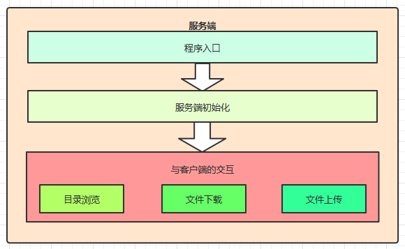  


### 2.2 客户端实现

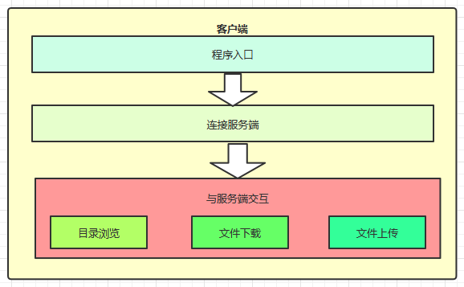  


## 三 详细设计

### 3.1 技术选型

1. 使用TCP编程技术实现客户端和服务端的开发，完成文件上下传的功能
2. 自定义客户端和服务端之间的通讯协议
3. 服务端多线程技术，实现高并发访问
4. 自定义异常维护业务安全
5. 使用JDK现有的API完成相关业务
   1. Socket，ServerSocket网络编程
   2. File文件类
   3. IO流相关类
   4. ResourceBundle配置文件读取


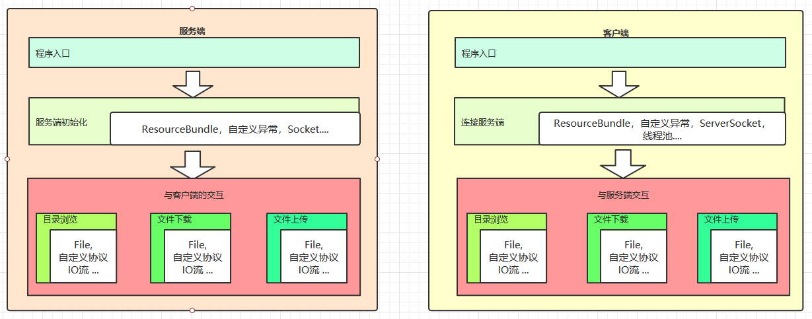 


### 3.2 协议定义

#### 协议介绍

协议就是客户端和服务端通讯双方共同遵守的规定。


TCP协议是区分客户端服务端的一个比较底层的协议，传输的数据是字节码数据，如下

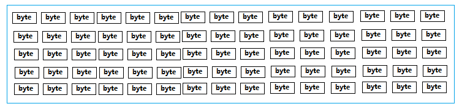 

当客户端连接服务端后，若要上传一个文件到服务端。直接将文件数据传给服务端，那么服务端该如何识别这个数据呢。对于服务端来讲收到的都是字节数据，服务端该如何识别客户端的操作意图，如果是上传文件，那么文件的类型是什么，文件的名字是什么等等信息。


**怎样让双方在沟通时理解对方的信息呢？**


我们可以把要发送给对方的数据前加一行描述信息，我们可以称为头信息。这个头信息包含了我要干什么，我的数据有哪些属性等信息，发头信息后再把具体的数据发送给对方。这样对方先把头信息获取，知道了我要做什么操作，发送过来的数据是是什么有什么数据，再接收具体的数据，就搞定了。

 


加了头信息的数据如下：

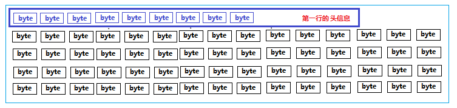 


#### 自定义协议

我们约定双方发送数据前要先发送一个头信息，如下

```
type=操作类型,fileName=文件名,status=操作状态,message=说明信息\r\n
```


说明：第一行头信息要和数据分开，用行分隔符分开即可，每个信息使用 key=value键值对表示，么个信息使用逗号分隔

1.  type：操作类型，对应的值可以是如下：

   ```
   scan：表示浏览目录操作
   upload：表示上传操作
   download：表示下载操作
   
   下载操作示例：
   type=download
   
   ```

2.  fileName：要浏览操作文件的文件名

   ```
   下载文件“美女.jpg”示例：
   type=download,fileName=美女.jpg
   ```

3.  status：操作状态

   ```
   表示服务端收到客户端请求后回复操作状态，ok表示成功，failed表示失败
   ```

4.  message：说明信息

   ```
   其他附加说明信息
   ```


一次文件下载的示例：

**客户端发送请求：**

```
type=download,fileName=root/美女.jpg,status=null,message=null\r\n
```

**服务端响应请求：**

- 成功

  ```
  type=download,fileName=root/美女.jpg,status=ok,message=null\r\n
  01010101010010美女数据010100101001010
  ```

- 失败

  ```java
  type=download,fileName=root/美女.jpg,status=failed,message=文件不存在！\r\n
  ```


#### 协议的封装

为了方便协议的定义和解析，我们可以使用面向对象的思想进行封装成一个类，Protocol

```java
// 把协议封装成一个类
public class Protocol {
    //协议数据
    private String type;    // 操作类型
    private String fileName;// 操作文件
    private String status;  // 操作状态
    private String message; // 说明信息

    /**
     * 操作类型
     */
    public static class Type {
       public static final String  SCAN="scan";//浏览
       public static final String  UPLOAD="upload";//浏览
       public static final String  DOWNLOAD="download";//浏览
    }

    /**
     * 操作状态
     */
    public static class Status {
       public static final String  OK="ok";//成功
       public static final String  FAILED="failed";//失败
    }
  
  //省略其他构造器及getter/setter
}
```


### 3.3 功能接口的定义

这里的接口，指定的是服务端暴露出来的功能。比如文件浏览功能，只要按照该接口指定的方式传输数据，就能完成功能了。

#### 文件浏览

- 客户端与服务端的交互流程

  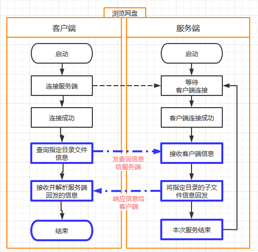

  

   

- **数据交互**

  **请求：客户端 ---> 服务端**

  ```
  type=scan,fileName=需要浏览的目录,status=null,message=null\r\n
  ```

  **响应： 服务端 --->客户端**

  1. **成功：**

     ```
     type=scan,fileName=需要浏览的目录,status=ok,message=null,
     xxx目录或者文件名称xxxxxx
     xxx目录或者文件名称xxxxxx
     xxx目录或者文件名称xxxxxx
     ```

  2. **失败：**

     ```
     type=scan,fileName=null,status=failed,message=目录不存在，只能浏览当前子目录,
     #没有后续数据
     ```

     失败的原因，就是服务端没有对应的目录，无法遍历。

  


#### 文件上传

- **文件上传交换流程**

  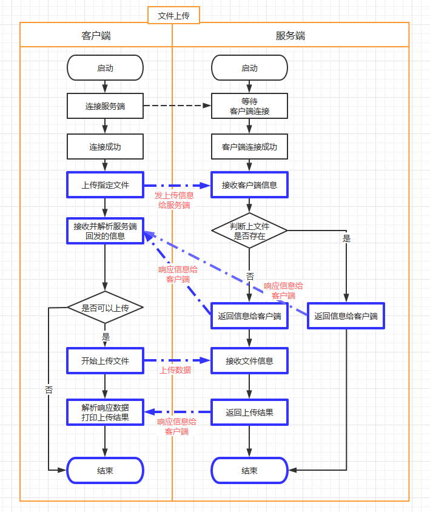 

  

- **数据交互**

  

  **请求：客户端 ---> 服务端**

  ```j
  type=upload,fileName=要上传的文件,status=null,message=null,
  ```

  注意：文件要体现在服务端的位置。客户端看到的文件都是基于服务端某一个文件夹而存在的，我们把这个文件夹叫做root。
  服务端开发时，可以任意指定一个合法的文件夹当做这个root。

  

  

  **响应： 服务端 --->客户端**

  1. 成功

     告诉客户端，文件可以上传的

     ```
   type=upload,fileName=要上传的文件,status=ok,message=null,
     ```
  
     客户端收到信息后，继续上传文件信息，文件接收完毕后继续响应

     ```
   type=upload,fileName=要上传的文件,status=ok,message=文件上传成功,
     ```
  
     

  2. 失败

     如果发现服务端已经存在该文件，提示客户端不要上传

     ```
   type=upload,fileName=要上传的文件,status=failed,message=文件已存在
     ```
  
     

  

#### 文件下载

- 文件下载流程

  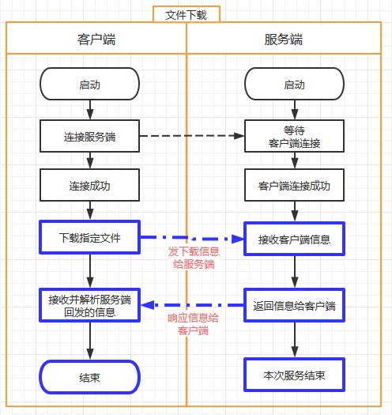 

  

  

- **数据交互**

  **请求：客户端 ---> 服务端**

  ```
  type=download,fileName=下载的文件名,status=null,message=null,
  ```

  **响应： 服务端 --->客户端**

  1. 成功

     ```
     type=download,fileName=下载的文件名,status=ok,message=134448,
     010101010010下载的文件字节数据010101010010100101001010010010010101....
     ```

     需要将下载的文件字节数据保存到文件中

  2. 失败

     ```
     type=download,fileName=下载的文件名,status=failed,message=文件不存在，请选择当前存在的子文件,
     ```

     只有协议数据，没有实际下载的文件数据

  


### 3.4 基础架构

#### 服务端架构

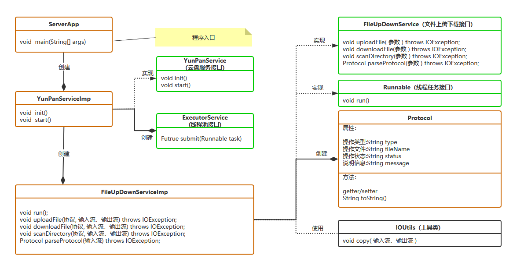 


代码结构：

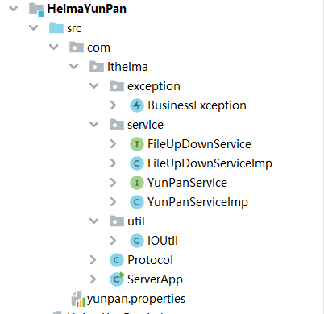 


基础代码请看看今天资料


#### 客户端架构

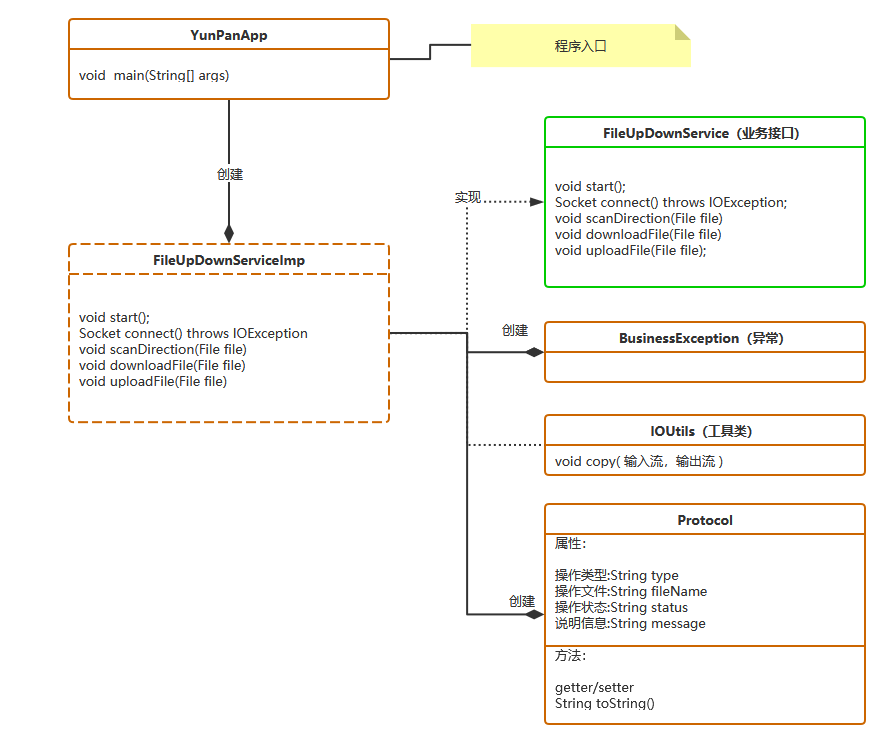  


项目结构：

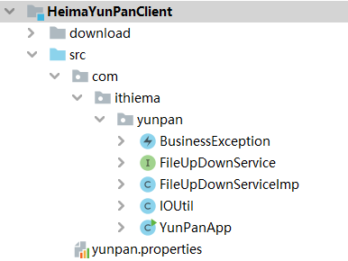 

基础代码请看看今天资料


## 四 开发实战

基于资料中提供的基础框架代码，完成客户端和服务端的开发.

资料中有代码


